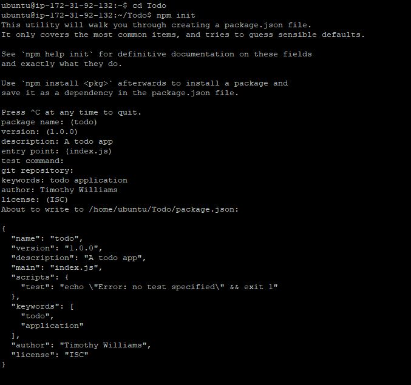
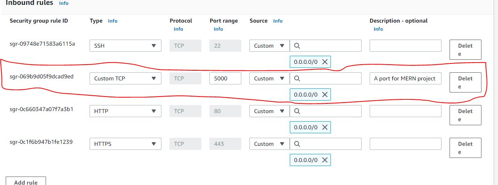
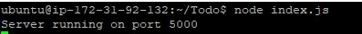
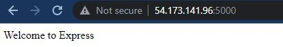
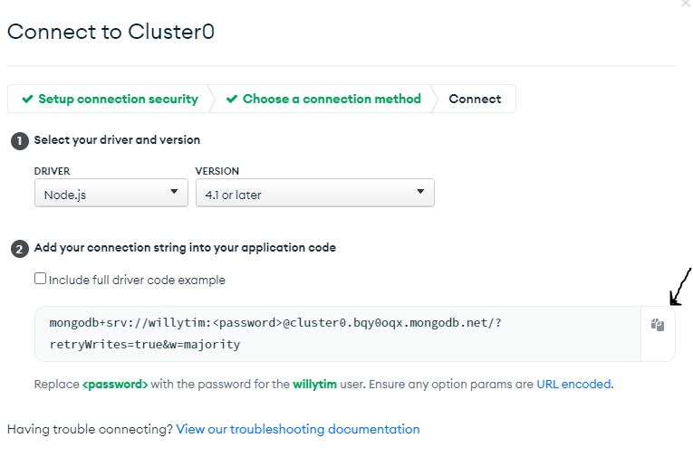
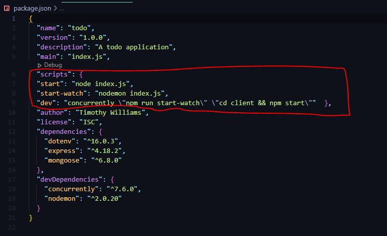
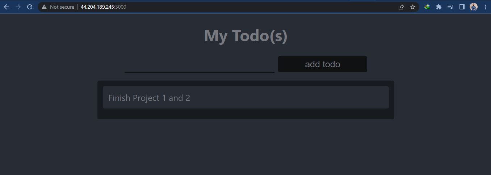

# MERN-STACK-IN-AWS
### This project shows the implementation of a web solution based on the MERN stack(ToDo App) in AWS Cloud. This project makes use of MongoDB DaaS

## STEP 0 - Prerequisite
In order to complete this project, you will need an AWS account and a virtual server with Ubuntu Server OS.

## STEP 1 – BACKEND CONFIGURATION
Update a list of packages in package manager

```
sudo apt update 
```

Upgrade ubuntu

```
sudo apt upgrade 
```

Get the location of Node.js software from Ubuntu repositories.

```
curl -fsSL https://deb.nodesource.com/setup_18.x | sudo -E bash - 
```

Install Node.js with the command below

```
sudo apt-get install -y nodejs
```

*Note: The command above installs both nodejs and npm. NPM is a package manager for Node*

Verify the node installation

```
node -v
```

```
npm -v
```
Create a new directory for your To-Do project and move into the directory
```
mkdir Todo && cd Todo
```
OR Clone the repository 

``` 
git clone https://github.com/willyta/MERN-STACK-IN-AWS.git
```
Initialise your project
```
npm init
```



*Install ExpressJs and dotenv*

```
npm install express dotenv

```
*we need to open port 5000 in EC2 Security Groups*



Create and open the index file

```
vim index.js
```

Simply paste the code into the file

```
const express = require('express');
require('dotenv').config();
 
const app = express();
 
const port = process.env.PORT || 5000;
 
app.use((req, res, next) => {
res.header("Access-Control-Allow-Origin", "\*");
res.header("Access-Control-Allow-Headers", "Origin, X-Requested-With, Content-Type, Accept");
next();
});
 
app.use((req, res, next) => {
res.send('Welcome to Express');
});
 
app.listen(port, () => {
console.log(`Server running on port ${port}`)
});
```

Open your terminal in the same directory as your index.js file and type:

```
node index.js
```



Open up your browser and try to access your server’s Public IP or Public DNS name followed by port 5000:

```
http://<PublicIP-or-PublicDNS>:5000
```


*Routes*

We need to create routes that will define various endpoints that the To-do app will depend on. So let us create a folder routes

```
mkdir routes && cd routes
```
Create a file api.js
```
vim api.js
```

Copy below code in the file

```
const express = require ('express');
const router = express.Router();
 
router.get('/todos', (req, res, next) => {
 
});
 
router.post('/todos', (req, res, next) => {
 
});
 
router.delete('/todos/:id', (req, res, next) => {
 
})
 
module.exports = router;
```

*Models*

Change directory back Todo folder with *cd ..* and install Mongoose

```
npm install mongoose
```

Create a new folder models 

```
mkdir models && cd models
```

Create a file and name it todo.js

```
vim todo.js
```

Then paste the code below

```
const mongoose = require('mongoose');
const Schema = mongoose.Schema;
 
//create schema for todo
const TodoSchema = new Schema({
action: {
type: String,
required: [true, 'The todo text field is required']
}
})
 
//create model for todo
const Todo = mongoose.model('todo', TodoSchema);
 
module.exports = Todo;
```

In Routes directory, open api.js with vim api.js, delete the code inside with :%d command and paste there code below into it then save and exit

```
const express = require ('express');
const router = express.Router();
const Todo = require('../models/todo');
 
router.get('/todos', (req, res, next) => {
 
//this will return all the data, exposing only the id and action field to the client
Todo.find({}, 'action')
.then(data => res.json(data))
.catch(next)
});
 
router.post('/todos', (req, res, next) => {
if(req.body.action){
Todo.create(req.body)
.then(data => res.json(data))
.catch(next)
}else {
res.json({
error: "The input field is empty"
})
}
});
 
router.delete('/todos/:id', (req, res, next) => {
Todo.findOneAndDelete({"_id": req.params.id})
.then(data => res.json(data))
.catch(next)
})
 
module.exports = router;
```

## MONGODB DATABASE

Create a file in your Todo directory and name it .env.
`touch .env`
`vi .env`

Add the connection string to access the database in it, just as below

`DB = 'mongodb+srv://<username>:<password>@<network-address>/<dbname>?retryWrites=true&w=majority'`

*NOTE Allow access to the MongoDB database from anywhere (Not secure, but it is ideal for testing) and make sure you change the time of deleting the entry from 6 Hours to 1 Week*




*Now we need to update the **index.js** to reflect the use of **.env** so that Node.js can connect to the database.*

Paste the entire code below in the index.js file

```
const express = require('express');
const bodyParser = require('body-parser');
const mongoose = require('mongoose');
const routes = require('./routes/api');
const path = require('path');
require('dotenv').config();
 
const app = express();
 
const port = process.env.PORT || 5000;
 
//connect to the database
mongoose.connect(process.env.DB, { useNewUrlParser: true, useUnifiedTopology: true })
.then(() => console.log(`Database connected successfully`))
.catch(err => console.log(err));
 
//since mongoose promise is depreciated, we overide it with node's promise
mongoose.Promise = global.Promise;
 
app.use((req, res, next) => {
res.header("Access-Control-Allow-Origin", "\*");
res.header("Access-Control-Allow-Headers", "Origin, X-Requested-With, Content-Type, Accept");
next();
});
 
app.use(bodyParser.json());
 
app.use('/api', routes);
 
app.use((err, req, res, next) => {
console.log(err);
next();
});
 
app.listen(port, () => {
console.log(`Server running on port ${port}`)
});
```

Start your server using the command:
```
node index.js
```
You shall see a message *‘Database connected successfully’*, if so – we have our backend configured.

## STEP 2 – FRONTEND CREATION

In the same root directory as your backend code, which is the Todo directory, run:
```
npx create-react-app client
```
Install nodemon and concurrently

```
npm install concurrently nodemon --save-dev
```

In *Todo* folder open the *package.json* file. Change the highlighted part of the below screenshot and replace with the code below

```
"scripts": {
"start": "node index.js",
"start-watch": "nodemon index.js",
"dev": "concurrently \"npm run start-watch\" \"cd client && npm start\""
},
```



Creating your React Components
From your Todo directory run

```
cd client
```

Move to the src directory

```
cd src
```

Inside your *src* folder create another folder called *components*

```
mkdir components && cd components
```

Inside ‘components’ directory create three files *Input.js, ListTodo.js and Todo.js.*

Open Input.js file

```
vi Input.js
```

Copy and paste the following

```
import React, { Component } from 'react';
import axios from 'axios';
 
class Input extends Component {
 
state = {
action: ""
}
 
addTodo = () => {
const task = {action: this.state.action}
 
    if(task.action && task.action.length > 0){
      axios.post('/api/todos', task)
        .then(res => {
          if(res.data){
            this.props.getTodos();
            this.setState({action: ""})
          }
        })
        .catch(err => console.log(err))
    }else {
      console.log('input field required')
    }
 
}
 
handleChange = (e) => {
this.setState({
action: e.target.value
})
}
 
render() {
let { action } = this.state;
return (
<div>
<input type="text" onChange={this.handleChange} value={action} />
<button onClick={this.addTodo}>add todo</button>
</div>
)
}
}
 
export default Input
```

Go to the clients directory
`cd ../..`

Install Axios
```npm install axios```

Go to the ‘components’ directory

```
cd src/components
```

open your ListTodo.js

```
vi ListTodo.js
```

Copy and paste the following code

```
import React from 'react';
 
const ListTodo = ({ todos, deleteTodo }) => {
 
return (
<ul>
{
todos &&
todos.length > 0 ?
(
todos.map(todo => {
return (
<li key={todo._id} onClick={() => deleteTodo(todo._id)}>{todo.action}</li>
)
})
)
:
(
<li>No todo(s) left</li>
)
}
</ul>
)
}
 
export default ListTodo
Then in your Todo.js file you write the following code
import React, {Component} from 'react';
import axios from 'axios';
 
import Input from './Input';
import ListTodo from './ListTodo';
 
class Todo extends Component {
 
state = {
todos: []
}
 
componentDidMount(){
this.getTodos();
}
 
getTodos = () => {
axios.get('/api/todos')
.then(res => {
if(res.data){
this.setState({
todos: res.data
})
}
})
.catch(err => console.log(err))
}
 
deleteTodo = (id) => {
 
    axios.delete(`/api/todos/${id}`)
      .then(res => {
        if(res.data){
          this.getTodos()
        }
      })
      .catch(err => console.log(err))
 
}
 
render() {
let { todos } = this.state;
 
    return(
      <div>
        <h1>My Todo(s)</h1>
        <Input getTodos={this.getTodos}/>
        <ListTodo todos={todos} deleteTodo={this.deleteTodo}/>
      </div>
    )
 
}
}
 
export default Todo;
```
Move to the src folder
`cd ..`

Make sure that you are in the src folder and run
`vi App.js`

Copy and paste the code below into it

```
import React from 'react';
 
import Todo from './components/Todo';
import './App.css';
 
const App = () => {
return (
<div className="App">
<Todo />
</div>
);
}
 
export default App;
```

In the src directory open the App.css then paste the following

```
.App {
text-align: center;
font-size: calc(10px + 2vmin);
width: 60%;
margin-left: auto;
margin-right: auto;
}
 
input {
height: 40px;
width: 50%;
border: none;
border-bottom: 2px #101113 solid;
background: none;
font-size: 1.5rem;
color: #787a80;
}
 
input:focus {
outline: none;
}
 
button {
width: 25%;
height: 45px;
border: none;
margin-left: 10px;
font-size: 25px;
background: #101113;
border-radius: 5px;
color: #787a80;
cursor: pointer;
}
 
button:focus {
outline: none;
}
 
ul {
list-style: none;
text-align: left;
padding: 15px;
background: #171a1f;
border-radius: 5px;
}
 
li {
padding: 15px;
font-size: 1.5rem;
margin-bottom: 15px;
background: #282c34;
border-radius: 5px;
overflow-wrap: break-word;
cursor: pointer;
}
 
@media only screen and (min-width: 300px) {
.App {
width: 80%;
}
 
input {
width: 100%
}
 
button {
width: 100%;
margin-top: 15px;
margin-left: 0;
}
}
 
@media only screen and (min-width: 640px) {
.App {
width: 60%;
}
 
input {
width: 50%;
}
 
button {
width: 30%;
margin-left: 10px;
margin-top: 0;
}
}
```

In the src directory open the index.css

`vim index.css`

Copy and paste the code below

```
body {
margin: 0;
padding: 0;
font-family: -apple-system, BlinkMacSystemFont, "Segoe UI", "Roboto", "Oxygen",
"Ubuntu", "Cantarell", "Fira Sans", "Droid Sans", "Helvetica Neue",
sans-serif;
-webkit-font-smoothing: antialiased;
-moz-osx-font-smoothing: grayscale;
box-sizing: border-box;
background-color: #282c34;
color: #787a80;
}
 
code {
font-family: source-code-pro, Menlo, Monaco, Consolas, "Courier New",
monospace;
}
```

When you are in the Todo directory run:

```
npm run dev
```



